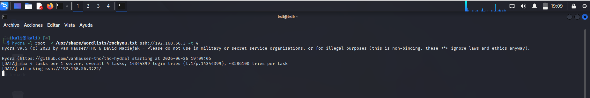
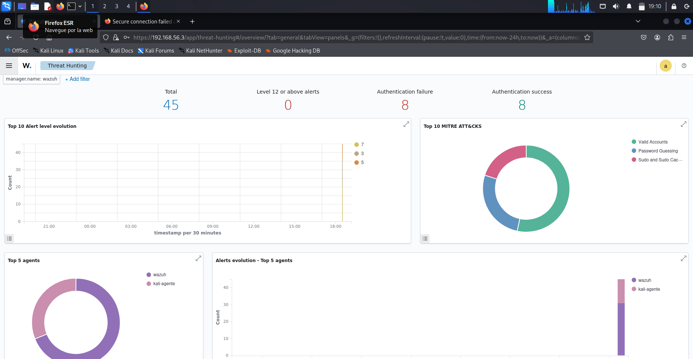
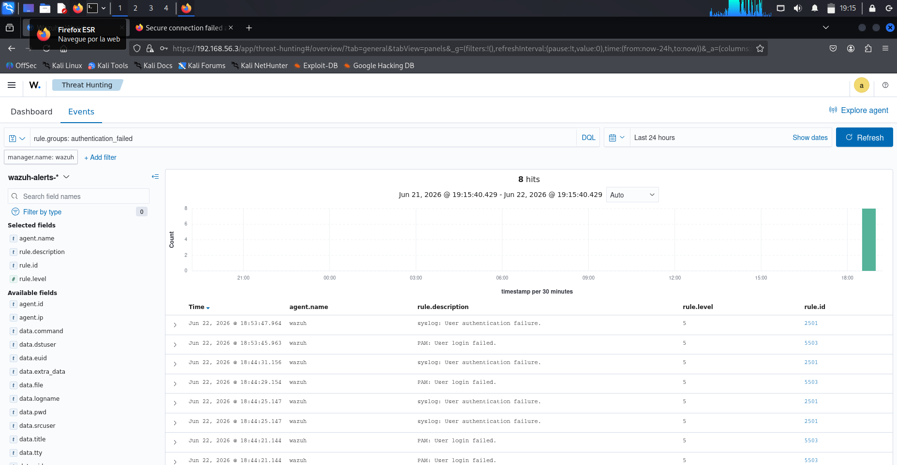
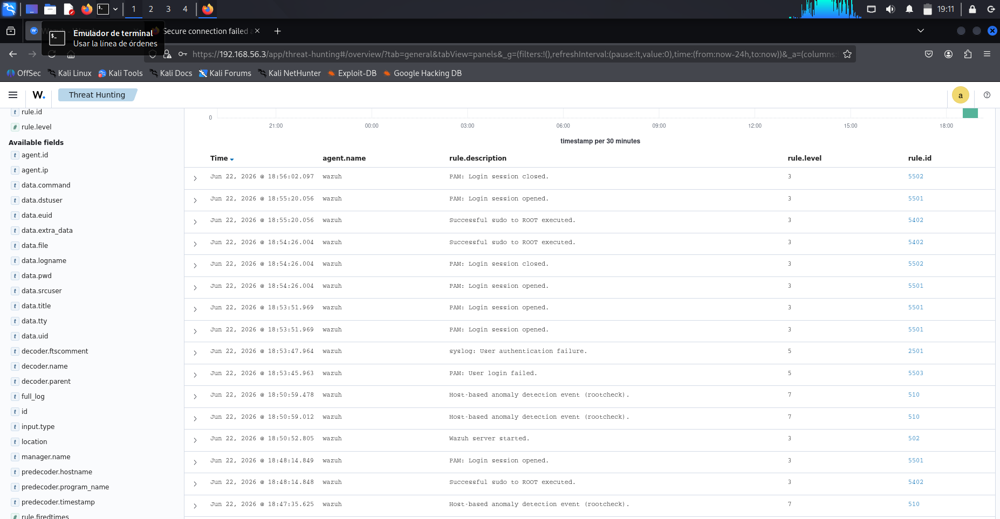

🇪🇸 **ES**

# Wazuh Home Lab — Detección de Amenazas con SIEM

## Índice
- [Descripción](#descripción)
- [Arquitectura del lab](#arquitectura-del-lab)
- [Herramientas](#herramientas)
- [Objetivos del lab](#objetivos-del-lab)
- [Despliegue](#despliegue)
- [Simulación del ataque](#simulación-del-ataque)
- [Detección y análisis](#detección-y-análisis)
- [Conclusión](#conclusión)
- [Aviso legal](#aviso-legal)

---

## Descripción

Lab de ciberseguridad defensiva montado sobre VirtualBox en un ThinkPad T480s con Ubuntu como host. El objetivo es desplegar Wazuh como SIEM, conectar agentes reales, simular un ataque de fuerza bruta SSH y analizar las alertas generadas mapeándolas con el framework MITRE ATT&CK.

---

## Arquitectura del lab

| Máquina | SO | Rol |
|---|---|---|
| Wazuh Manager | Ubuntu 22.04 | SIEM / Manager / Dashboard |
| Kali Linux | Kali GNU/Linux 2025.2 | Agente / Máquina atacante |

Red host-only en VirtualBox — entorno completamente aislado.

---

## Herramientas

- Wazuh v4.8 (Manager + Indexer + Dashboard)
- VirtualBox con red host-only
- Hydra (simulación de fuerza bruta SSH)
- MITRE ATT&CK Framework

---

## Objetivos del lab

- Desplegar un SIEM funcional en entorno virtualizado con recursos limitados
- Registrar y gestionar agentes de monitorización
- Simular un ataque real y verificar su detección en tiempo real
- Analizar eventos con DQL y mapearlos con MITRE ATT&CK
- Practicar el flujo de trabajo de un analista SOC: detección → investigación → respuesta

---

## Despliegue

La instalación de Wazuh se realizó mediante el instalador oficial en línea de comandos. El proceso desplegó de forma secuencial el Indexer, el Manager, Filebeat y el Dashboard, confirmando el arranque correcto de cada servicio.

*Instalación completada — todos los servicios arrancados correctamente.*

Una vez finalizada la instalación, el dashboard muestra el resumen de agentes conectados y las alertas de las últimas 24 horas clasificadas por severidad.

*Vista general del dashboard — 1 agente activo, 20 alertas de severidad media y 25 de severidad baja.*

---

## Simulación del ataque

Se registró Kali Linux como agente en el Wazuh Manager para monitorizar su actividad en tiempo real.

*Kali GNU/Linux 2025.2 registrado como agente activo (kali-agente) en el Manager.*

Desde Kali se lanzó un ataque de fuerza bruta SSH contra el Manager usando Hydra con el diccionario rockyou.txt — más de 14 millones de intentos de login.

*Hydra atacando ssh://192.168.56.3:22 — simulación de un ataque de fuerza bruta real.*

---

## Detección y análisis

Wazuh detectó el ataque en tiempo real. En el módulo de Threat Hunting se visualizaron todas las alertas generadas, con un total de 8 fallos de autenticación y 8 accesos legítimos, mapeados automáticamente con MITRE ATT&CK.

*Dashboard de Threat Hunting — técnicas detectadas: Password Guessing, Valid Accounts, Sudo and Sudo Caching.*

Filtrando por `rule.groups: authentication_failed` con DQL se aislaron únicamente los eventos de autenticación fallida, mostrando los rule.id 2501 y 5503 correspondientes a fallos de SSH y PAM.

*8 hits filtrados por authentication_failed — eventos de syslog y PAM con nivel de severidad 5.*

La vista completa de eventos muestra la secuencia cronológica del ataque: fallos de autenticación, apertura y cierre de sesiones, escalada con sudo y eventos de rootcheck.

*Timeline completo de eventos — desde el ataque hasta la sesión legítima posterior.*

---

## Conclusión

Este lab demuestra cómo desplegar y operar un SIEM open source en un entorno doméstico con recursos limitados. A través de la simulación de un ataque real de fuerza bruta SSH se ha validado la capacidad de Wazuh para detectar, alertar y clasificar amenazas según frameworks estándar del sector. El proceso ha reforzado habilidades clave para un analista SOC: análisis de logs, correlación de eventos, threat hunting y uso de DQL.

🚧 Lab en expansión continua.

---

## Aviso legal

Todas las simulaciones se han realizado en un entorno aislado y controlado sobre máquinas propias. Nunca ejecutes estas técnicas contra sistemas de terceros o entornos en producción.

---
---

🇬🇧 **EN**

# Wazuh Home Lab — Threat Detection with SIEM

## Index
- [Description](#description)
- [Lab Architecture](#lab-architecture)
- [Tools](#tools)
- [Lab Goals](#lab-goals)
- [Deployment](#deployment)
- [Attack Simulation](#attack-simulation)
- [Detection & Analysis](#detection--analysis)
- [Conclusion](#conclusion)
- [Legal Notice](#legal-notice)

---

## Description

Defensive cybersecurity home lab built on VirtualBox running on a ThinkPad T480s (Ubuntu host). The goal is to deploy Wazuh as a SIEM, connect real agents, simulate an SSH brute force attack, and analyze the generated alerts mapped to the MITRE ATT&CK framework.

---

## Lab Architecture

| Machine | OS | Role |
|---|---|---|
| Wazuh Manager | Ubuntu 22.04 | SIEM / Manager / Dashboard |
| Kali Linux | Kali GNU/Linux 2025.2 | Agent / Attacker machine |

Host-only network in VirtualBox — fully isolated environment.

---

## Tools

- Wazuh v4.8 (Manager + Indexer + Dashboard)
- VirtualBox with host-only network
- Hydra (SSH brute force simulation)
- MITRE ATT&CK Framework

---

## Lab Goals

- Deploy a functional SIEM in a virtualized environment with limited resources
- Register and manage monitoring agents
- Simulate a real attack and verify detection in real time
- Analyze events with DQL and map them to MITRE ATT&CK
- Practice the SOC analyst workflow: detection → investigation → response

---

## Deployment

Wazuh was installed using the official command-line installer. The process sequentially deployed the Indexer, Manager, Filebeat, and Dashboard, confirming each service started correctly.

*Installation complete — all services started successfully.*

Once installed, the dashboard shows the connected agents summary and the last 24 hours of alerts classified by severity.

*Dashboard overview — 1 active agent, 20 medium severity alerts and 25 low severity alerts.*

---

## Attack Simulation

Kali Linux was registered as an agent in the Wazuh Manager to monitor its activity in real time.

*Kali GNU/Linux 2025.2 registered as an active agent (kali-agente) in the Manager.*

From Kali, an SSH brute force attack was launched against the Manager using Hydra with the rockyou.txt wordlist — over 14 million login attempts.

*Hydra attacking ssh://192.168.56.3:22 — real brute force attack simulation.*

---

## Detection & Analysis

Wazuh detected the attack in real time. The Threat Hunting module displayed all generated alerts, with 8 authentication failures and 8 successful logins, automatically mapped to MITRE ATT&CK.

*Threat Hunting dashboard — detected techniques: Password Guessing, Valid Accounts, Sudo and Sudo Caching.*

Filtering by `rule.groups: authentication_failed` with DQL isolated only the failed authentication events, showing rule.id 2501 and 5503 corresponding to SSH and PAM failures.

*8 hits filtered by authentication_failed — syslog and PAM events at severity level 5.*

The full event view shows the chronological sequence of the attack: authentication failures, session open/close events, sudo escalation, and rootcheck events.

*Complete event timeline — from the attack through the subsequent legitimate session.*

---

## Conclusion

This lab demonstrates how to deploy and operate an open source SIEM in a home environment with limited resources. Through the simulation of a real SSH brute force attack, Wazuh's ability to detect, alert, and classify threats according to industry-standard frameworks has been validated. The process reinforced key SOC analyst skills: log analysis, event correlation, threat hunting, and DQL querying.

🚧 Lab under continuous expansion.

---

## Legal Notice

All simulations were carried out in an isolated, controlled environment on personally owned machines. Never use these techniques against third-party systems or production environments.
