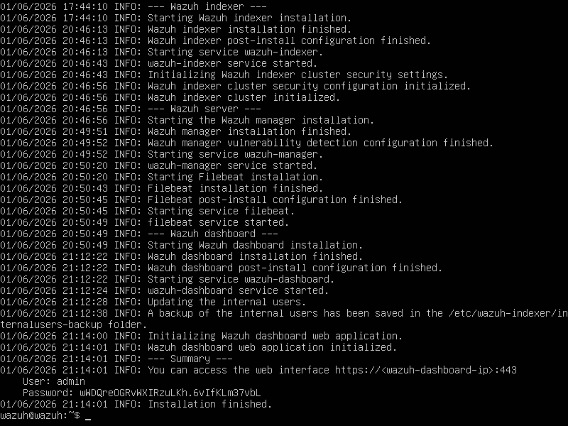
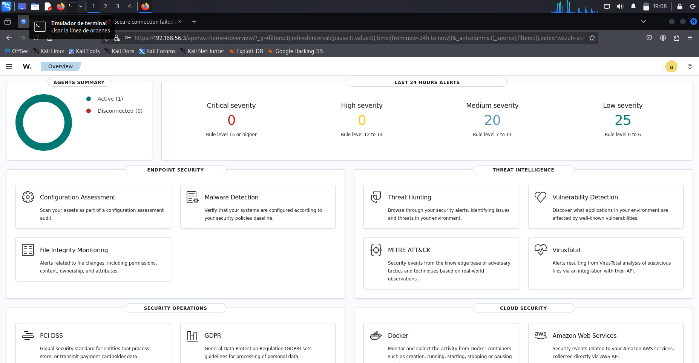
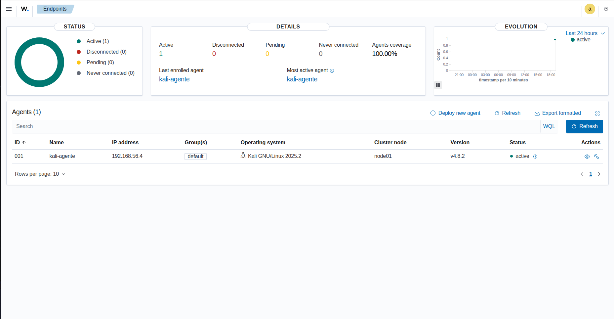
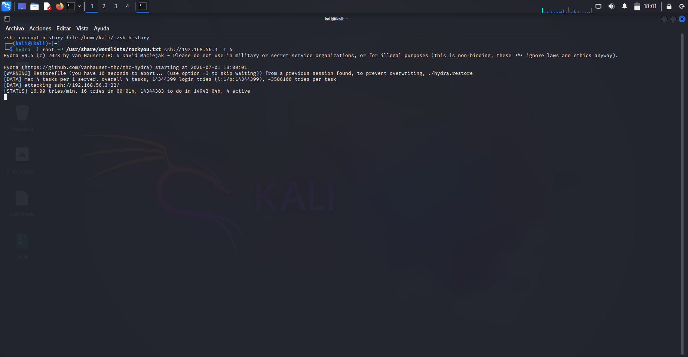
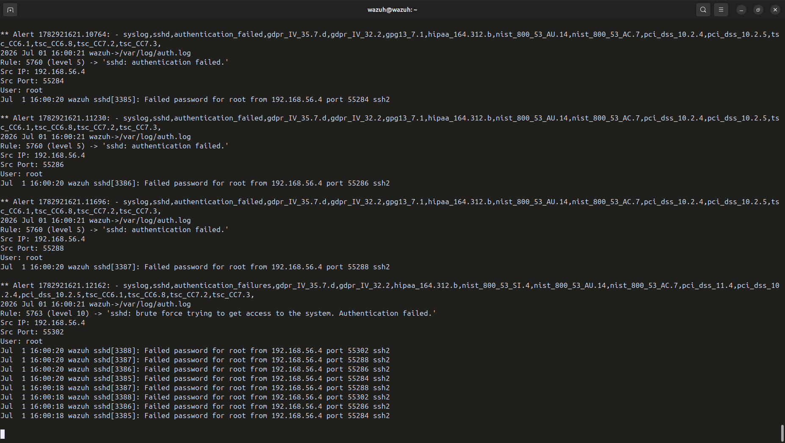
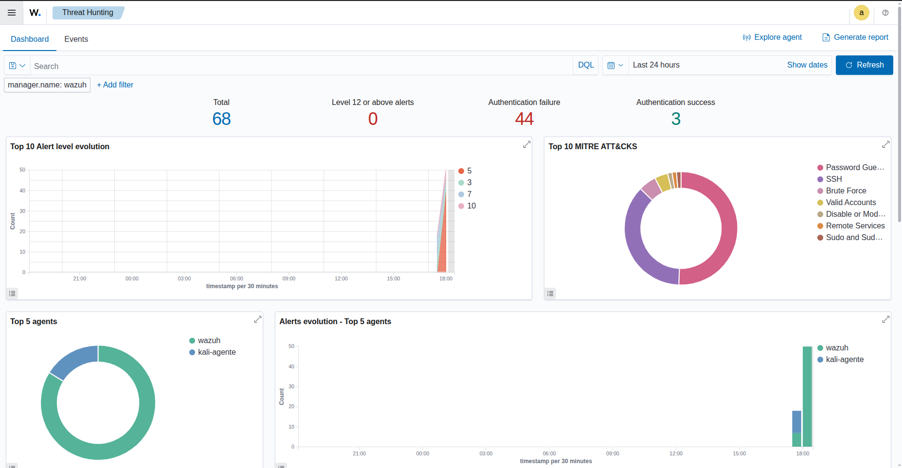
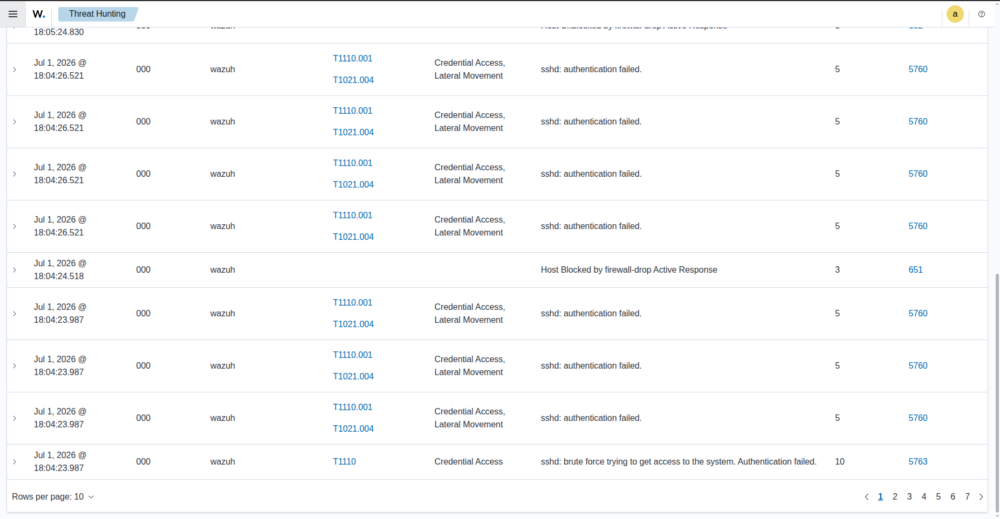
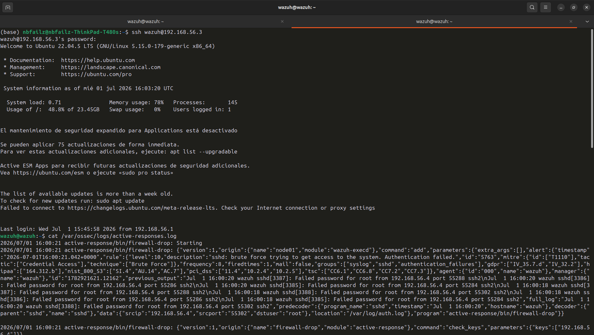
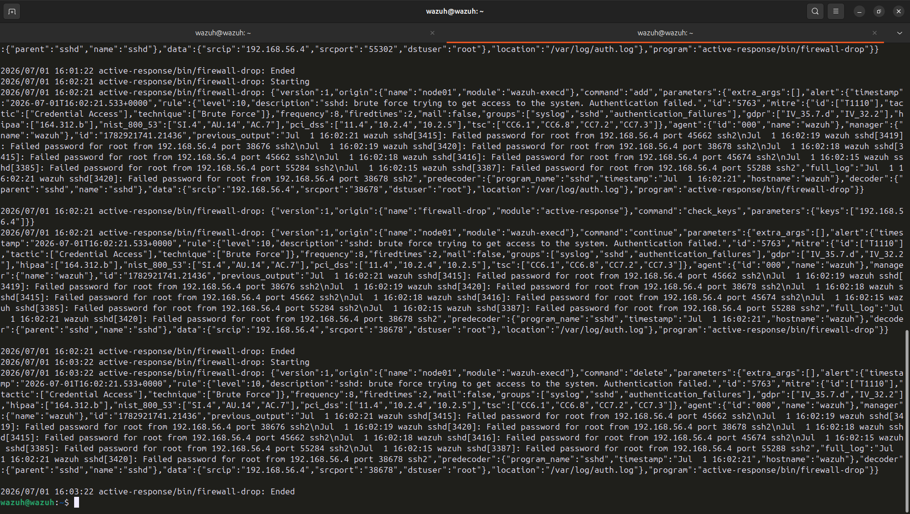

🇪🇸 **ES**
 
# Wazuh Home Lab — Detección de Amenazas con SIEM
 
## Índice
- [Descripción](#descripción)
- [Arquitectura del lab](#arquitectura-del-lab)
- [Herramientas](#herramientas)
- [Objetivos del lab](#objetivos-del-lab)
- [Despliegue](#despliegue)
- [Simulación del ataque](#simulación-del-ataque)
- [Detección y análisis](#detección-y-análisis)
- [Active Response — Bloqueo automático](#active-response--bloqueo-automático)
- [Conclusión](#conclusión)
- [Aviso legal](#aviso-legal)
---
 
## Descripción
 
Lab de ciberseguridad defensiva montado sobre VirtualBox en un ThinkPad T480s con Ubuntu como host. El objetivo es desplegar Wazuh como SIEM, conectar agentes reales, simular un ataque de fuerza bruta SSH y analizar las alertas generadas mapeándolas con el framework MITRE ATT&CK. El lab incorpora además Active Response para el bloqueo automático de IPs atacantes.
 
---
 
## Arquitectura del lab
 
| Máquina | SO | Rol |
|---|---|---|
| Wazuh Manager | Ubuntu 22.04 | SIEM / Manager / Dashboard |
| Kali Linux | Kali GNU/Linux 2025.2 | Agente / Máquina atacante |
 
Red host-only en VirtualBox — entorno completamente aislado.
 
---
 
## Herramientas
 
- Wazuh v4.8 (Manager + Indexer + Dashboard)
- VirtualBox con red host-only
- Hydra (simulación de fuerza bruta SSH)
- MITRE ATT&CK Framework
- firewall-drop (Active Response integrado en Wazuh)
---
 
## Objetivos del lab
 
- Desplegar un SIEM funcional en entorno virtualizado con recursos limitados
- Registrar y gestionar agentes de monitorización
- Simular un ataque real y verificar su detección en tiempo real
- Analizar eventos con DQL y mapearlos con MITRE ATT&CK
- Configurar Active Response para bloqueo automático de IPs atacantes
- Practicar el flujo de trabajo de un analista SOC: detección → investigación → respuesta automatizada
---
 
## Despliegue
 
La instalación de Wazuh se realizó mediante el instalador oficial en línea de comandos. El proceso desplegó de forma secuencial el Indexer, el Manager, Filebeat y el Dashboard, confirmando el arranque correcto de cada servicio.
 

*Instalación completada — todos los servicios arrancados correctamente.*
 
Una vez finalizada la instalación, el dashboard muestra el resumen de agentes conectados y las alertas de las últimas 24 horas clasificadas por severidad.
 

*Vista general del dashboard — 1 agente activo, 20 alertas de severidad media y 25 de severidad baja.*
 
---
 
## Simulación del ataque
 
Se registró Kali Linux como agente en el Wazuh Manager para monitorizar su actividad en tiempo real.
 

*Kali GNU/Linux 2025.2 registrado como agente activo (kali-agente) en el Manager.*
 
Desde Kali se lanzó un ataque de fuerza bruta SSH contra el Manager usando Hydra con el diccionario rockyou.txt — más de 14 millones de intentos de login con 4 hilos en paralelo.
 

*Hydra atacando ssh://192.168.56.3:22 con 4 hilos en paralelo — simulación de un ataque de fuerza bruta real.*
 
---
 
## Detección y análisis
 
Wazuh detectó el ataque en tiempo real. En el `alerts.log` se observa el flujo completo: primero la regla 5760 (authentication failed, level 5) por cada intento individual, y después la regla 5763 (level 10) al acumularse suficientes fallos, clasificada automáticamente como **Brute Force** según MITRE ATT&CK T1110.
 

*alerts.log en tiempo real — regla 5760 por intentos individuales y regla 5763 (level 10) al detectar el patrón de fuerza bruta desde 192.168.56.4.*
 
En el módulo de Threat Hunting del dashboard se visualizaron todas las alertas generadas: 44 fallos de autenticación en las últimas 24 horas, con las técnicas MITRE ATT&CK detectadas (Password Guessing, SSH, Brute Force) y el pico de actividad correspondiente al ataque.
 

*Dashboard de Threat Hunting — 44 authentication failures, top MITRE ATT&CKs: Brute Force, SSH, Password Guessing. Pico de actividad a las 18:00 coincide con el ataque.*
 
La tabla de eventos muestra el ciclo completo: fallos de autenticación individuales (regla 5760), detección del brute force (regla 5763, level 10, MITRE T1110) y confirmación del bloqueo automático (regla 651 — Host Blocked by firewall-drop Active Response).
 

*Timeline de eventos — reglas 5760, 5763 y 651 (Host Blocked by firewall-drop Active Response).*
 
---
 
## Active Response — Bloqueo automático
 
### Configuración
 
Se configuró la función `firewall-drop` de Wazuh en `ossec.conf` para bloquear automáticamente la IP atacante durante 60 segundos al detectar la regla 5763 (brute force SSH):
 
```xml
<active-response>
  <command>firewall-drop</command>
  <location>local</location>
  <rules_id>5763</rules_id>
  <timeout>60</timeout>
</active-response>
```
 
### Resultado
 
Al dispararse la regla 5763, Wazuh ejecutó automáticamente `firewall-drop` bloqueando la IP 192.168.56.4 (Kali) mediante iptables. El log de Active Response muestra el ciclo completo:
 
- **`add`** — bloqueo activado al detectar brute force
- **`check_keys`** — verificación de la IP a bloquear
- **`continue`** — bloqueo aplicado
- **`delete`** — bloqueo eliminado automáticamente tras 60 segundos

*active-responses.log — ciclo completo: firewall-drop Starting → add → check_keys → continue → Ended → delete tras 60s.*
 
El proceso se repitió de forma autónoma cada vez que Kali reactivaba el ataque tras el timeout, demostrando la capacidad de respuesta automatizada continua del sistema.
 

*Segundo ciclo de bloqueo — firedtimes: 2. Wazuh detecta, bloquea y libera de forma completamente autónoma.*
 
---
 
## Conclusión
 
Este lab demuestra cómo desplegar y operar un SIEM open source en un entorno doméstico con recursos limitados. A través de la simulación de un ataque real de fuerza bruta SSH se ha validado la capacidad de Wazuh para detectar, alertar, clasificar amenazas según frameworks estándar del sector y responder de forma automática bloqueando la IP atacante. El proceso ha reforzado habilidades clave para un analista SOC: análisis de logs, correlación de eventos, threat hunting, uso de DQL y configuración de respuesta activa automatizada.
 
🚧 Lab en expansión continua.
 
---
 
## Aviso legal
 
Todas las simulaciones se han realizado en un entorno aislado y controlado sobre máquinas propias. Nunca ejecutes estas técnicas contra sistemas de terceros o entornos en producción.
 
---
---
 
🇬🇧 **EN**
 
# Wazuh Home Lab — Threat Detection with SIEM
 
## Index
- [Description](#description)
- [Lab Architecture](#lab-architecture)
- [Tools](#tools)
- [Lab Goals](#lab-goals)
- [Deployment](#deployment)
- [Attack Simulation](#attack-simulation)
- [Detection & Analysis](#detection--analysis)
- [Active Response — Automated Blocking](#active-response--automated-blocking)
- [Conclusion](#conclusion)
- [Legal Notice](#legal-notice)
---
 
## Description
 
Defensive cybersecurity home lab built on VirtualBox running on a ThinkPad T480s (Ubuntu host). The goal is to deploy Wazuh as a SIEM, connect real agents, simulate an SSH brute force attack, and analyze the generated alerts mapped to the MITRE ATT&CK framework. The lab also incorporates Active Response for automatic blocking of attacking IPs.
 
---
 
## Lab Architecture
 
| Machine | OS | Role |
|---|---|---|
| Wazuh Manager | Ubuntu 22.04 | SIEM / Manager / Dashboard |
| Kali Linux | Kali GNU/Linux 2025.2 | Agent / Attacker machine |
 
Host-only network in VirtualBox — fully isolated environment.
 
---
 
## Tools
 
- Wazuh v4.8 (Manager + Indexer + Dashboard)
- VirtualBox with host-only network
- Hydra (SSH brute force simulation)
- MITRE ATT&CK Framework
- firewall-drop (Wazuh built-in Active Response)
---
 
## Lab Goals
 
- Deploy a functional SIEM in a virtualized environment with limited resources
- Register and manage monitoring agents
- Simulate a real attack and verify detection in real time
- Analyze events with DQL and map them to MITRE ATT&CK
- Configure Active Response for automatic IP blocking
- Practice the SOC analyst workflow: detection → investigation → automated response
---
 
## Deployment
 
Wazuh was installed using the official command-line installer. The process sequentially deployed the Indexer, Manager, Filebeat, and Dashboard, confirming each service started correctly.
 

*Installation complete — all services started successfully.*
 
Once installed, the dashboard shows the connected agents summary and the last 24 hours of alerts classified by severity.
 

*Dashboard overview — 1 active agent, 20 medium severity alerts and 25 low severity alerts.*
 
---
 
## Attack Simulation
 
Kali Linux was registered as an agent in the Wazuh Manager to monitor its activity in real time.
 

*Kali GNU/Linux 2025.2 registered as an active agent (kali-agente) in the Manager.*
 
From Kali, an SSH brute force attack was launched against the Manager using Hydra with the rockyou.txt wordlist — over 14 million login attempts across 4 parallel threads.
 

*Hydra attacking ssh://192.168.56.3:22 with 4 parallel threads — real brute force attack simulation.*
 
---
 
## Detection & Analysis
 
Wazuh detected the attack in real time. The `alerts.log` shows the full flow: rule 5760 (authentication failed, level 5) for each individual attempt, escalating to rule 5763 (level 10) once enough failures accumulated, automatically classified as **Brute Force** under MITRE ATT&CK T1110.
 

*alerts.log in real time — rule 5760 for individual attempts and rule 5763 (level 10) upon detecting the brute force pattern from 192.168.56.4.*
 
The Threat Hunting dashboard showed all generated alerts: 44 authentication failures in the last 24 hours, with MITRE ATT&CK techniques detected (Password Guessing, SSH, Brute Force) and a clear activity spike corresponding to the attack.
 

*Threat Hunting dashboard — 44 authentication failures, top MITRE ATT&CKs: Brute Force, SSH, Password Guessing. Activity spike at 18:00 matches the attack.*
 
The events table shows the complete cycle: individual authentication failures (rule 5760), brute force detection (rule 5763, level 10, MITRE T1110), and automated block confirmation (rule 651 — Host Blocked by firewall-drop Active Response).
 

*Event timeline — rules 5760, 5763, and 651 (Host Blocked by firewall-drop Active Response).*
 
---
 
## Active Response — Automated Blocking
 
### Configuration
 
The `firewall-drop` Active Response was configured in `ossec.conf` to automatically block the attacking IP for 60 seconds upon triggering rule 5763 (SSH brute force):
 
```xml
<active-response>
  <command>firewall-drop</command>
  <location>local</location>
  <rules_id>5763</rules_id>
  <timeout>60</timeout>
</active-response>
```
 
### Result
 
Upon triggering rule 5763, Wazuh automatically executed `firewall-drop`, blocking IP 192.168.56.4 (Kali) via iptables. The Active Response log shows the complete cycle:
 
- **`add`** — block activated upon brute force detection
- **`check_keys`** — verification of the IP to block
- **`continue`** — block applied
- **`delete`** — block automatically removed after 60 seconds

*active-responses.log — full cycle: firewall-drop Starting → add → check_keys → continue → Ended → delete after 60s.*
 
The process repeated autonomously each time Kali resumed the attack after the timeout, demonstrating the system's continuous automated response capability.
 

*Second block cycle — firedtimes: 2. Wazuh detects, blocks, and releases fully autonomously.*
 
---
 
## Conclusion
 
This lab demonstrates how to deploy and operate an open source SIEM in a home environment with limited resources. Through the simulation of a real SSH brute force attack, Wazuh's ability to detect, alert, classify threats according to industry-standard frameworks, and respond automatically by blocking the attacking IP has been fully validated. The process reinforced key SOC analyst skills: log analysis, event correlation, threat hunting, DQL querying, and automated active response configuration.
 
🚧 Lab under continuous expansion.
 
---
 
## Legal Notice
 
All simulations were carried out in an isolated, controlled environment on personally owned machines. Never use these techniques against third-party systems or production environments.
 
